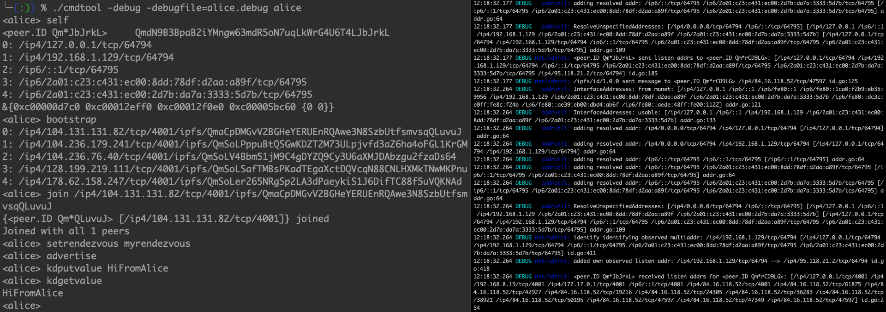

## Interactive Command Tool (WIP)

This is an interactive command line tool for playing with, testing and analysing this package.

There are two main purposes:

- stay in your session while executing commands
- watch the outputs of logging and debugging to files in parallel

You can have multiple sessions and do your experiments with the package for a better understanding.

### Preparations

I am using Go Modules so for me `go build` works fine.

### ./cmdtool

    ./cmdtool [-debug [-debugfile=<filename>]] <sessionname>
    
    e.g.
        ./cmdtool alice
        ./cmdtool -debug bob
        ./cmdtool -debug -debugfile=myfile.out charly

### Add A Command

- add in `commander.commandsInit` a new entry in the commands map: 

	`commands["mynewcmd"] = "mynewcmd \n\t is my new command\n"`
	
- add in `commander.executeCommand` an appropriate new case:

    `case "mynewcmd":
    			myNewCmd(commandFields[1:])`
    			
- create `commander.myNewCmd` like this:

        func myNewCmd(arguments []string) {
        
            // your code here
            
            fmt.Printf(prompt)
        }
    
### Current Commands

WIP - only a snapshot:

    advertise
         advertise rendezvous point
    
    bootstrap
         list bootstrap peer(s)
    
    join [<bootstrap> ...]
         join bootstrap peer(s)
    
    kdclose
         kdclose
    
    kdfindlocal
         kdfindlocal
    
    kdfindpeer
         kdfindpeer
    
    kdfindproviders
         kdfindproviders searches until the context expires
    
    kdfindprovidersasync
         kdfindprovidersasync is the same thing as kdfindproviders, but returns a channel.
         Peers will be returned on the channel as soon as they are found, even before the search query completes.
    
    kdgetvalue
         kdgetvalue
    
    kdgetvalues
         kdgetvalues
    
    kdprovide
         kdprovide makes this node announce that it can provide a value for the given key
    
    kdputvalue <value>
         kdputvalue
    
    kdupdate
         kdupdate signals the routingTable to Update its last-seen status on the given peer.
    
    quit
         close the session and exit
    
    rendezvous
         show last rendezvous string
    
    self
         show information of this node
    
    setrendezvous <string>
         set cid of string as rendezvous point

### Example

`./cmdtool -debug -debugfile alice.debug alice`

    <alice> join
    {<peer.ID Qm*VQKNAd> [/ip4/178.62.158.247/tcp/4001]} joined
    {<peer.ID Qm*zaDs64> [/ip4/104.236.76.40/tcp/4001]} joined
    {<peer.ID Qm*QLuvuJ> [/ip4/104.131.131.82/tcp/4001]} joined
    {<peer.ID Qm*L1KrGM> [/ip4/104.236.179.241/tcp/4001]} joined
    {<peer.ID Qm*wMKPnu> [/ip4/128.199.219.111/tcp/4001]} joined
    Joined with all 5 peers
    <alice> setrendezvous myrendezvous
    <alice> advertise
    <alice> kdputvalue HiFromAlice
    <alice> kdgetvalue
    HiFromAlice
    <alice> quit
  
  
  Screenshot from an example with debugging output:
    
  